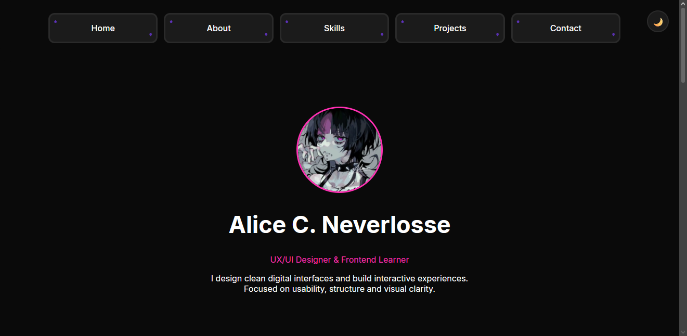

# Personal Portfolio

Responsive personal portfolio showcasing UX/UI design exploration and frontend projects.

## Live Website

You can view the portfolio here:

https://NLosse-A.github.io/Presentation

## Overview

This portfolio was created to showcase my work, experiments, and learning journey in **UX/UI design and frontend development**.
The site focuses on clean layouts, component-based design, and responsive interfaces.

## Features

* Responsive layout for desktop, tablet, and mobile
* Light / Dark theme toggle
* GitHub project integration
* Card-based UI design system
* Smooth navigation

## Technologies

* HTML
* CSS
* JavaScript

## Project Structure

```
portfolio
│
├── index.html
│
├── style.css
│
└── script.js
```

## Sections

The portfolio currently includes:

* About
* Skills
* Projects
* Contact

## Purpose

This project serves as a personal space to document my progress and showcase projects related to UX/UI and frontend development.

## License

This project is open for learning and inspiration.
